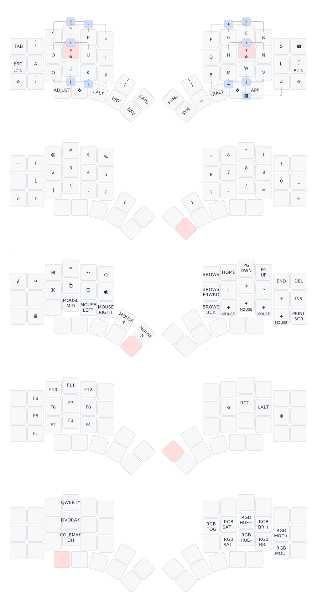

# My personalized Kyria's Keymap

## Resources

- [Flash firmware with QMK and docker](https://docs.qmk.fm/getting_started_docker#docker-quick-start)
- [Flash firmware with QMK](https://docs.splitkb.com/hc/en-us/articles/6330981035676-Aurora-Build-Guide-20-Flashing-Firmware)
- [Online keymap builder](https://config.qmk.fm/#/frooastboard/walnut/LAYOUT_all)
- [Online keymap draver](https://keymap-drawer.streamlit.app/?example_yaml=kyria.yaml)
- [QMK setup on SUSE](https://aethernaut.eu/log/2024-08-21-qmk-setup.html)

## How to

- clone qmk_firmware from github
- copy udev file to have the keyboard recognized by the system:

```bash
sudo cp utils/udev/50-qmk.rules /etc/udev/rules.d/
```

- copy this keymap setup to qmk_firmware (symlink not working):

```bash
cp -rf ~/projects/kyria-keymap/ ~/qmk_firmware/keyboards/splitkb/kyria/keymaps/
```

- Compile and flash this software with docker (recommended):

```bash
util/docker_build.sh splitkb/kyria/rev3:kyria-keymap:flash
```

- Compile this software (qmk must be installed):

```bash
qmk compile -kb splitkb/kyria/rev3 -km kyria-keymap`
```

- Flash compiled software (qmk dependencies must be installed):

```bash
qmk flash -bl dfu path/to_my/firmware_file.hex
```

## Description

The default keymap contains 5 layers which allows it to include all keys found on an ANSI layout TKL keyboard plus media keys.
Hardware features of the Kyria such as OLEDs, rotary encoders and underglow are also supported.

The five different layers are the following:

1. Base layer (QWERTY, Colemak-DH or Dvorak)
2. Navigation layer
3. Symbols/Numbers layer
4. Function layer
5. Adjust layer


After making transformations to the classic ANSI US QWERTY TKL 60% to arrive to the layout of the Kyria, as illustrated in the animation above, the result looks like this:

## Base layer(s)



Keyboard is using combo keys, by two keys at the same time.

NOTE: The default layer settings set by those keys are _NOT_ stored in EEPROM and thus do not persist through boots. If you wish to change the default layer in a non-volatile manner, either change the order of the layers in the firmware, for example like so if you want to set Dvorak as the new default:

```c
enum layers {
    _DVORAK = 0,
    _QWERTY,
    _COLEMAK_DH,
    _HSNT,
    _NAV,
    _SYM,
    _FUNCTION,
    _ADJUST
};
```

or re-define the `QWERTY`, `COLEMAK` and `DVORAK` keys to point to custom keycodes starting on `SAFE_RANGE` and calling the `set_single_persistent_default_layer` function inside of `process_record_user`.

## Hardware Features

### OLEDs

The OLEDs display the current layer at the top of the active layers stack, logo and lock status (caps lock, num lock, scroll lock).
